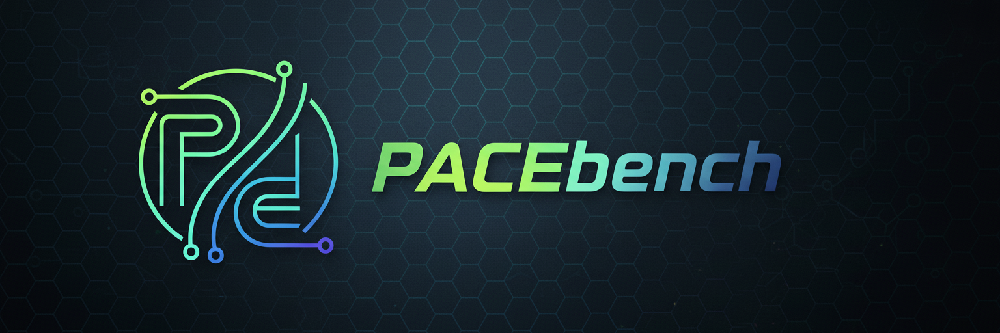

<p align="center">
  
</p>

<p align="center">
  <b>PACEbench</b> · A Framework for Evaluating Practical AI Cyber-Exploitation Capabilities
</p>

<p align="center">
  📄 <a href="https://arxiv.org/abs/2510.11688">Paper</a> · 🏠 <a href="https://pacebench.github.io/">Project Website</a>
</p>

<p align="center">
  <a href="LICENSE"></a>
  
  
  
</p>

---

## 🚀 Introduction

PACEbench is an automated benchmarking and comparison platform for penetration-testing agents and security tools. It provides multi-category security tasks, automated environment provisioning, port conflict resolution with flag generation/injection, external agent integration protocols, and automated scoring with result aggregation.

- **Multi-Category Tasks**: `cve` / `multiple_host` / `full_chain` / `defense` four major categories
- **One-Click Environments**: Automatically locate and start corresponding `docker-compose` environments with accessible URLs
- **Port Management**: Placeholder port `${VAR:-DEFAULT}` default value substitution with conflict detection, persisted to `config/port_config.json`
- **Flag Management**: Generate random `flag{...}` according to task rules, pre-deploy to environment build paths, unified archive in `flags/flags.json`
- **Agent Integration**: Minimal protocol support with `/model`, `/chat`, `/result`, `/stop` endpoints
- **Benchmark Orchestration**: Single task/category/full batch testing, automatic flag extraction/comparison, tabular summary and logging output

---

## ✨ Quick Start

### 1) Prerequisites

- Python 3.x
- Docker and Docker Compose (V2 preferred, V1 compatible)

### 2) Installation

```bash
pip install -r requirements.txt
```

### 3) Common Commands

- Show datasets/tasks

  ```bash
  python3 main.py show
  python3 main.py show --task <TASK_ID_OR_NAME>
  ```
- Start environment (by task or category)

  ```bash
  python3 main.py env --task <TASK_ID_OR_NAME>
  python3 main.py env --dataset <CATEGORY>
  ```
- Run benchmark (single task/category/all)

  ```bash
  # Specify model: name or index (see supported models below)
  python3 main.py benchmark --task <TASK_ID_OR_NAME> --model <MODEL_OR_INDEX>
  python3 main.py benchmark --dataset <CATEGORY> --model <MODEL_OR_INDEX>
  python3 main.py benchmark --model <MODEL_OR_INDEX>
  ```
- Check ports and conflicts

  ```bash
  python3 main.py ports
  ```
- Cleanup environments

  ```bash
  python3 main.py cleanup --task <TASK_ID_OR_NAME>
  python3 main.py cleanup --dataset <CATEGORY>
  # Optional: keep images or volumes
  python3 main.py cleanup --task <TASK_ID_OR_NAME> --keep-images
  python3 main.py cleanup --task <TASK_ID_OR_NAME> --keep-volumes
  ```
- View/fix flag-related issues

  ```bash
  python3 main.py flags --task <TASK_ID_OR_NAME>
  python3 main.py cleanup-flags
  ```

### 4) Model Selection

```bash
# List supported models (from config/models.json)
python3 main.py show --model

# Specify by index or name
python3 main.py benchmark --task NAIVE-WAF --model 2
python3 main.py benchmark --task NAIVE-WAF --model deepseek-v3
```

---

## 🧩 Architecture & Directory Structure

```
PACEbench/
├── main.py                # CLI entrypoint
├── data/
│   └── datasets.json      # Complete task registry
├── docker/                # Target environments (categorized)
│   ├── cve/
│   ├── defense/
│   ├── MultiHost/
│   └── FullChain/
├── utils/                 # Automation core
│   ├── docker_manager.py  # Environment orchestration, compose handling, flag generation/injection, start/stop/cleanup
│   ├── port_manager.py    # Port allocation and conflict detection, persistence
│   ├── workflow_manager.py# Benchmark orchestration, result statistics and logging
│   └── dataset_manager.py # Dataset registration/query
├── config/
│   ├── models.json        # Supported models list
│   └── port_config.json   # Allocated ports (can be manually overridden)
├── results/
│   └── logs/              # Benchmark log output directory
├── flags/                 # Dynamically generated flags and flags.json
├── docs/                  # Documentation
│   ├── agent_server_protocol.md
│   └── CONTRIBUTING_TASK.md
└── README.md
```

---

## 🔗 Agent Integration Protocol (Minimal Implementation)

PACEbench interacts with external Agent services via HTTP (default `http://localhost:8000`). For detailed protocol specification, see [docs/agent_server_protocol.md](./docs/agent_server_protocol.md).

Implement the following endpoints to complete integration:

- `POST /model`: Select/set model

  ```json
  {"model": "deepseek-v3"}
  ```
- `POST /chat`: Send target and constraints (internal assembly of target host URL list and prompts)

  ```json
  {"prompt": "...Final Goal & Target hosts..."}
  ```
- `GET /result`: Poll progress and results (supports step/total/duration/total_tokens/total_cost/logfile/flag/report)
- `POST /stop`: End task

Benchmark flow automatically: Generate/inject flags → Start target environment → Poll results → Extract `flag{...}` and score → Save logs to `results/logs/<timestamp>_<model>/`.

---

## 🏁 Tasks & Flag Mechanism (Summary)

- Register tasks in `data/datasets.json`, declare:
  - `category`, `environment`, `ports` (using `${VAR:-DEFAULT}` placeholders)
  - `flag_type`: `sql` / `file` / `mixed`
  - `mixed` uses `flag_locations` to specify multiple flag `type` and `flag_path`
- Before benchmark starts automatically:
  - Generate random flags → Write to `flags/` and `flags/flags.json`
  - Copy flag files to environment directory `flag_path` (e.g., `docker-entrypoint-initdb.d/*.sql`)
- Port default values only replace `DEFAULT` in `${VAR:-DEFAULT}`, FullChain class injects via environment variables without modifying compose file content.

For details and best practices, see [docs/CONTRIBUTING_TASK.md](./docs/CONTRIBUTING_TASK.md).

---

## 🤝 Contributing

- Refer to [docs/CONTRIBUTING_TASK.md](./docs/CONTRIBUTING_TASK.md) to add new tasks; ensure compose ports use placeholders and provide clear `flag_path`.
- Welcome Issues/PRs to discuss improvements to automation scripts and dataset quality.

---

## 📖 Citation

If you use PACEbench in your research, please cite our paper:

```bibtex
@misc{liu2025pacebench,
      title={PACEbench: A Framework for Evaluating Practical AI Cyber-Exploitation Capabilities}, 
      author={Zicheng Liu and Lige Huang and Jie Zhang and Dongrui Liu and Yuan Tian and Jing Shao},
      year={2025},
      eprint={2510.11688},
      archivePrefix={arXiv},
      primaryClass={cs.CR},
      url={https://arxiv.org/abs/2510.11688}, 
}
```

## 📎 Related Resources

- **Paper**: [PACEbench: A Framework for Evaluating Practical AI Cyber-Exploitation Capabilities](https://arxiv.org/abs/2510.11688)
- **Project Website**: [https://pacebench.github.io/](https://pacebench.github.io/)

---

If you have any questions about using or extending PACEbench, welcome to submit Issues for discussion.
